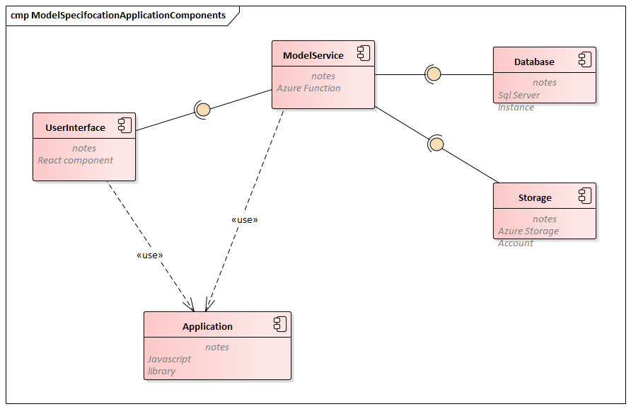

# Meta Data Management

## Start the app

```
npm install
npm start
```

- Note this work via npm workspaces

Access the application on https://localhost:3005

## Setup

### Directory Structure

The repository contains 2 deployment units and 1 common application library

This components are to be assembled in the following way



- The React application runs on the browser. More [here](./userinterface/README.md)
- The Azure Functions will run in the cloud. More [here](./services/README.md)
- The application library is intended to be shared functionality which could either run in the browser or on the azure functions.

### Node

This is a nodejs based application.
Please install node with [nvm](https://github.com/nvm-sh/nvm)

### React

`create-react-app` was used to create this single page application.
Subsequently the application was ejected in order to customize the webpack config.

### Typescript

The react application and the azure functions are set up for typescript.

### Azure Functions

This project deploys service components as azure functions.

For development please ensure that [azure core functions](https://docs.microsoft.com/en-us/azure/azure-functions/functions-run-local) is installed.

New functions have been created with

```
func new
```

## Developing

Open vscode at the root of the repository where you can see userinterface, service and application sub folders

### You must create a new terminal window for each of these

Start the webpack build and watch with

Start the webpack dev server with

```
cd userinterface
npm start
```

Start the azure function runtime with

```
cd services
npm start
```

###  Module Federation

This application relies upon externally deployed module federations specifically
- style management 
- application frame

## Deployment

The application is deployed to the cloud as a Dockerfile via gitHub actions.


## Azure Settings Management

Retrieve settings locally
```func azure functionapp fetch-app-seetings fnapsvcdatasetsapi ```

Publish settings 
```func azure functionapp publish fnapsvcdatasetsapi --publish-settings-only```